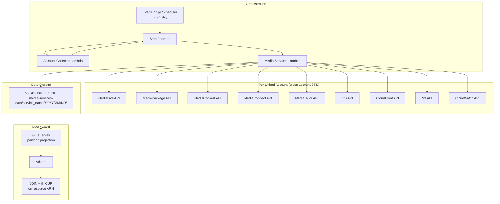

# Design: Media Services Data Collection Module

## Overview

This design describes the Media Services data collection module for the CID (Cloud Intelligence Dashboards) framework. The module collects inventory, operational metrics, workflow topology, and cost optimization signals from AWS Media Services across linked accounts in an AWS Organization.

The module follows the established CID module pattern: a single inline Lambda function (ZipFile) orchestrated by a Step Function, collecting data via cross-account role assumption, writing JSONL to S3 partitioned by service and date, and exposing data through Glue tables with partition projection for Athena queries.

**Key design decisions:**
- **No Glue Crawler**: Glue tables are defined directly in CloudFormation with partition projection (year/month/day), eliminating crawler latency and cost.
- **Common Lambda Layer**: The framework — cross-account role assumption, region iteration, record enrichment, JSONL writing, S3 upload, tag retrieval, and Data Collection Monitor logging — is packaged as a reusable Lambda layer (`common`), consumed via the `DataCollectionModule` superclass. The working source is `local-test/lambdas/common/utils.py`; it will be published from `data-collection/deploy/layers/common/`.
- **Per-service S3 paths and Glue tables**: Each of the 11 service collectors writes to its own S3 prefix and has its own Glue table, enabling independent schema evolution and targeted queries.
- **Workflow tracing via resource ARN links**: End-to-end media pipeline tracing is achieved by recording `upstream_resource_arns` and `downstream_resource_arns` in each record, plus a derived `workflow_id`, enabling graph traversal and total-cost-per-pipeline queries in Athena.
- **Cost optimization detection inline**: Optimization opportunities are detected during collection (not post-hoc), with `optimization_type` and `estimated_impact` fields embedded in a dedicated `cost_optimization` table.

## Architecture



The Lambda function contains 11 collector functions, each responsible for a single service domain. On each invocation (one per linked account), the Lambda:

1. Assumes the cross-account role via STS
2. Iterates over configured regions
3. Calls each collector, which returns a list of records
4. Enriches records with `payer_id` and `collection_time`
5. Writes per-service JSONL files to S3 using the path pattern `media-services-data/{service_name}/{YYYY}/{MM}/{DD}/{account_id}-{region}.json`

## Components and Interfaces

### CloudFormation Resources

| Resource | Type | Purpose |
|----------|------|---------|
| `LambdaRole` | `AWS::IAM::Role` | Execution role with STS AssumeRole, S3 PutObject, optional KMS |
| `CommonLayerArn` | Parameter | ARN of the shared CID common Lambda layer (deployed separately, referenced by this module) |
| `LambdaFunction` | `AWS::Lambda::Function` | Inline Python (ZipFile) with all 11 collectors, attaches CommonLayerArn |
| `LogGroup` | `AWS::Logs::LogGroup` | 60-day retention CloudWatch log group |
| `MediaLiveTable` | `AWS::Glue::Table` | Glue table with partition projection for MediaLive data |
| `MediaPackageTable` | `AWS::Glue::Table` | Glue table with partition projection for MediaPackage data |
| `MediaConvertTable` | `AWS::Glue::Table` | Glue table with partition projection for MediaConvert data |
| `MediaConnectTable` | `AWS::Glue::Table` | Glue table with partition projection for MediaConnect data |
| `MediaTailorTable` | `AWS::Glue::Table` | Glue table with partition projection for MediaTailor data |
| `IvsTable` | `AWS::Glue::Table` | Glue table with partition projection for IVS data |
| `CloudFrontTable` | `AWS::Glue::Table` | Glue table with partition projection for CloudFront data |
| `S3StorageTable` | `AWS::Glue::Table` | Glue table with partition projection for S3 storage data |
| `CloudWatchMetricsTable` | `AWS::Glue::Table` | Glue table with partition projection for CloudWatch metrics |
| `WorkflowTracingTable` | `AWS::Glue::Table` | Glue table with partition projection for workflow tracing |
| `CostOptimizationTable` | `AWS::Glue::Table` | Glue table with partition projection for cost optimization |
| `ModuleStepFunction` | `AWS::StepFunctions::StateMachine` | Shared state machine template |
| `ModuleRefreshSchedule` | `AWS::Scheduler::Schedule` | Daily EventBridge schedule with 30-min flex window |
| `AnalyticsExecutor` | `Custom::LambdaAnalyticsExecutor` | CID analytics tracking |

### Lambda Collector Functions

Each collector follows the signature `collect_<service>(ctx) -> list[dict]`, where `ctx` is a
`CollectorContext` from the common layer supplying `session`, `region`, `account_id`, and the
records collected so far. A single-argument signature is used so that regional, global, and
derived collectors are interchangeable — derived collectors have no region, and metrics and
tracing collectors need access to other collectors' output.

The `Scope` column gives the `Collector` scope each is declared with:

| Collector | Scope | AWS Client | API Calls | Output `service` value |
|-----------|-------|-----------|-----------|----------------------|
| `collect_medialive` | `REGIONAL` | `medialive` | `list_channels`, `list_inputs` | `medialive` |
| `collect_mediapackage` | `REGIONAL` | `mediapackage` | `list_channels`, `list_origin_endpoints`, `list_harvest_jobs` | `mediapackage` |
| `collect_mediapackagev2` | `REGIONAL` | `mediapackagev2` | `list_channel_groups`, `list_channels`, `list_origin_endpoints`, `list_harvest_jobs` | `mediapackagev2` |
| `collect_mediaconvert` | `REGIONAL` | `mediaconvert` | `describe_endpoints`, `list_queues`, `list_job_templates` | `mediaconvert` |
| `collect_mediaconnect` | `REGIONAL` | `mediaconnect` | `list_flows` | `mediaconnect` |
| `collect_mediatailor` | `REGIONAL` | `mediatailor` | `list_playback_configurations`, `list_source_locations` | `mediatailor` |
| `collect_ivs` | `REGIONAL` | `ivs` | `list_channels`, `list_recording_configurations` | `ivs` |
| `collect_cloudfront` | `GLOBAL` | `cloudfront` | `list_distributions` | `cloudfront` |
| `collect_s3_storage` | `DERIVED` | `s3` | `list_buckets`, `get_bucket_location`, `get_bucket_tagging`, `get_bucket_lifecycle_configuration` | `s3_storage` |
| `collect_cloudwatch_metrics` | `DERIVED` | `cloudwatch` | `get_metric_data`, batched per region | `cloudwatch_metrics` |
| `collect_workflow_tracing` | `DERIVED` | none | Builds the graph from other collectors' output | `workflow_tracing` |
| `collect_cost_optimization` | `DERIVED` | none | Uses other collectors' output plus the metric records | `cost_optimization` |

CloudFront is `GLOBAL` because it has a single global endpoint. `collect_cloudwatch_metrics`
is `DERIVED` rather than `REGIONAL` so that it runs after the global pass and can therefore
cover CloudFront distributions as well as the regional services; it groups its queries by the
region owning each resource and batches them into `get_metric_data` calls of up to 500
queries. Its records carry each resource's real owning region; see "Region labels" below.

MediaPackage v2 is a three-level model, and `list_channels`, `list_origin_endpoints`, and
`list_harvest_jobs` all require `ChannelGroupName`, so the collector nests its enumeration
rather than issuing v1's two flat calls. v2 list summaries carry no ingest endpoints, so
MediaLive-to-v2 topology edges would require a `get_channel` per channel and are deferred.

#### S3 bucket association is reference-only

`collect_s3_storage` is `DERIVED`. It emits a bucket if and only if an already-collected media
resource's configuration names that bucket, and records the referencing service in
`associated_media_service`. There is no name-pattern or tag heuristic: a bucket with no
resolvable reference is not emitted, and `associated_media_service` therefore always holds a
real service name.

Scope is limited by *purpose*: a reference counts when the bucket holds media the pipeline
reads (content-in) or receives media the pipeline writes (content-out). Log/telemetry
destinations and ancillary assets are deliberately excluded.

| Purpose | Service | Reference field |
|---|---|---|
| in | MediaLive | `Input.Sources[].Url` (`s3://`, `s3ssl://`) |
| in | MediaConvert | `JobTemplate.Settings.Inputs[].FileInput` |
| in | MediaTailor | `SourceLocation.HttpConfiguration.BaseUrl`, `DefaultSegmentDeliveryConfiguration.BaseUrl`, `video_content_source_url` |
| in | CloudFront | `Origin.DomainName` where it resolves to an S3 endpoint |
| out | MediaLive | `Destinations[].Settings[].Url` (`s3://`, `s3ssl://`) |
| out | MediaConvert | `JobTemplate.Settings.OutputGroups[].*GroupSettings.Destination` |
| out | MediaPackage v1 | `HarvestJob.S3Destination.BucketName` *(explicit)* |
| out | MediaPackage v2 | `HarvestJob.Destination.S3Destination.BucketName` *(explicit)* |
| out | IVS | `RecordingConfiguration.destinationConfiguration.s3.bucketName` *(explicit)* |

All of these are available on a `list_*` summary, so association costs no per-resource describe
calls. MediaLive's output-group S3 settings shapes (`ArchiveS3Settings`, `HlsS3Settings`,
`FrameCaptureS3Settings`) carry only `CannedAcl` — the bucket lives in the channel's top-level
`Destinations[]`, which the list summary already returns.

**Excluded from the MVP.** Log/telemetry: CloudFront `LoggingConfig.Bucket` (needs a
`get_distribution_config` per distribution), MediaConvert Kantar/Nielsen log destinations.
Ancillary assets: MediaLive `ColorCorrection.Uri`, motion-graphics overlays, SDP locations;
MediaConvert sidecar captions and image inserter inputs; CloudFront CA-certificate bundles.
MediaConnect is excluded structurally — it has no S3 surface at all, only network transports.

**Deferred services** that do carry in-scope references: MediaPackage VOD
(`Asset.SourceArn`, an S3 object ARN) and IVS real-time
(`StorageConfiguration.s3.bucketName`).

**Known limitation.** A bucket reached only indirectly — through a Lambda, Step Function,
EC2-hosted encoder, or ALB-fronted origin — is named in no media service API and cannot be
found by any reference-based approach. This is an accepted, documented gap.

#### Collector declaration order is load-bearing

`collectors_in_scope` preserves declaration order within a scope, and two `DERIVED` collectors
depend on that:

- `collect_s3_storage` MUST be declared before `collect_workflow_tracing`.
  `_build_resource_index` indexes buckets as `("bucket", name)` from `s3_storage` records, and
  `_build_edges` consumes that index. Declaring it later would silently drop every bucket edge
  from the graph — no error, just a quieter topology.
- `collect_cost_optimization` reads the metric records, so it stays after
  `collect_cloudwatch_metrics`.

A test asserts the `s3_storage` → `workflow_tracing` ordering so the invariant cannot regress
into a silent data-quality bug.

#### Region labels

A `DERIVED` collector receives `region=None`, so `DataCollectionModule.emit()` writes its file
as `{account_id}-all.json`. That `all` is a segment of the **filename**, not a partition
directory, so it has no effect on Glue schemas or partition projection. Records still carry
each resource's true region: `collect_cloudwatch_metrics` passes the resource's owning region
into `base_record`, and `collect_s3_storage` derives each bucket's region from
`get_bucket_location`.

### S3 Path Pattern

```
s3://{bucket}/media-services-data/{service_name}/{YYYY}/{MM}/{DD}/{account_id}-{region}.json
```

Where `{service_name}` is one of: `medialive`, `mediapackage`, `mediapackagev2`, `mediaconvert`, `mediaconnect`, `mediatailor`, `ivs`, `cloudfront`, `s3_storage`, `cloudwatch_metrics`, `workflow_tracing`, `cost_optimization` — 12 collectors, and therefore 12 Glue tables.

For `DERIVED` collectors (`s3_storage`, `cloudwatch_metrics`, `workflow_tracing`,
`cost_optimization`) the `{region}` filename segment is the literal `all`, since those
collectors run once rather than per region. This is a filename token only — see "Region
labels" above.

### Glue Table Partition Projection Configuration

Each Glue table uses the following partition projection parameters (no crawler needed):

```yaml
Parameters:
  EXTERNAL: 'TRUE'
  projection.enabled: 'true'
  projection.year.type: integer
  projection.year.range: '2024,2040'
  projection.month.type: integer
  projection.month.range: '1,12'
  projection.month.digits: '2'
  projection.day.type: integer
  projection.day.range: '1,31'
  projection.day.digits: '2'
  storage.location.template: !Sub "s3://${DestinationBucket}${AWS::AccountId}/media-services-data/{service_name}/${!year}/${!month}/${!day}/"
```

Partition keys: `year` (integer), `month` (integer), `day` (integer).

`projection.month.digits` and `projection.day.digits` are **required**. The S3 key is built
with `strftime('%m')` and `strftime('%d')`, which zero-pad to two characters (`2026/08/20`).
An integer projection without `digits` generates unpadded values (`8`, `20`), so the
generated prefixes would never match the written keys and every query would return zero
rows.

### Cross-Account Role Assumption

```python
def assume_session(account_id, region):
    partition = boto3.session.Session().get_partition_for_region(region_name=region)
    cred = boto3.client('sts', region_name=region).assume_role(
        RoleArn=f"arn:{partition}:iam::{account_id}:role/{ROLE_NAME}",
        RoleSessionName="data_collection"
    )['Credentials']
    return boto3.Session(
        aws_access_key_id=cred['AccessKeyId'],
        aws_secret_access_key=cred['SecretAccessKey'],
        aws_session_token=cred['SessionToken']
    )
```

This uses `get_partition_for_region()` for partition-aware ARN construction (supports `aws`, `aws-cn`, `aws-us-gov`).

### Common Lambda Layer

The common layer (`data-collection/deploy/layers/common/`) is class-based. It provides
shared utilities used by the media-services module and available to other modules.

The layer is deployed independently and referenced via a `CommonLayerArn` parameter in the
module template. For local testing, a mirrored copy at `local-test/lambdas/common/` allows
`from common.utils import ...` without the layer.

#### Error hierarchy

`CidError` carries an HTTP-mapped status code, a caller-facing `message`, an operator-facing
`detail`, and a fatal/non-fatal `prognosis`. Subclasses set only `_ERR_MSG` and
`_DEFAULT_CODE`:

| Class | Default code | Raised when |
|-------|--------------|-------------|
| `CidAwsSessionError` | 500 | Role assumption or session creation fails |
| `CidClientConfigError` | 500 | A boto3 client cannot be built for a service/region |
| `CidInvalidRequestError` | 406 | The Lambda event is missing required fields |
| `CidDataStoreError` | 500 | Collected data cannot be written or uploaded |

#### Context objects

| Class | Purpose |
|-------|---------|
| `ModuleContext` | Configuration from environment variables: `bucket_name`, `prefix`, `role_name`, `module`, `regions`, `max_retries`, `retry_mode`, `tmp_dir` |
| `ExecutionContext` | Per-invocation state from the event: `account_id`, `payer_id`, `regions`, `params`, `main_exe_uuid`, `stack_version`, `resource_prefix`, plus mutable `record_count`, `status_code`, `location`, `description` |
| `CollectorContext` | Everything one collector call needs: `session`, `region`, `account_id`, `mod_ctx`, `exec_ctx`, `collected`, plus `client()`, `client_in()`, `records_for()`, `all_records()`, and `note_failure()` |

`ModuleContext.prefix` is the **data path** prefix used to build S3 keys, from the `PREFIX`
environment variable. `ExecutionContext.resource_prefix` is the **resource** prefix the state
machine sends in the event's `prefix` field. These are distinct and must not be conflated.

#### `DcUtils` — stateless helpers

All methods are static, so callers use `DcUtils.assume_session(...)` without instantiating:

| Method | Purpose |
|--------|---------|
| `assume_session(account_id, region, role_name, mod_ctx)` | Cross-account STS role assumption with partition-aware ARN |
| `get_client(session, service_name, region, mod_ctx, **kwargs)` | Build a service client, raising `CidClientConfigError` on failure |
| `get_client_for_account(service_name, account_id, region, role_name, mod_ctx)` | Assume and build a client in one call |
| `get_boto_config(mod_ctx)` | botocore `Config` carrying the module's retry settings |
| `enrich_record(record, payer_id)` | Add `payer_id` and `collection_time` to a record |
| `write_jsonl(records, tmp_file, append=False)` | Serialize records as JSONL, truncating by default so a warm container cannot append to a previous invocation's file |
| `s3_key(prefix, account_id, region, sub_name)` | Generate the date-partitioned S3 key path |
| `upload_to_s3(tmp_file, bucket, key=None, prefix=..., account_id=..., region=..., sub_name=...)` | Upload a file, returning the key written |
| `get_resource_tags(client, resource_arn)` | Retrieve resource tags, returning empty list on failure |
| `tags_to_list(tags)` | Normalize a tag dict or list into `{Key, Value}` dicts |

#### `StatusLogger` — Data Collection Monitor entries

Builds and stores the structured log entry the monitor dashboard reads. The entry schema
matches the one `main-state-machine.json` writes, so Lambda-emitted and Step
Function-emitted entries share a Glue table: `Timestamp`, `DataCollectionRegion`,
`DataCollectionAccountId`, `Module`, `ModuleFunction`, `Params`, `PayerId`, `AccountId`,
`Region`, `StatusCode`, `SubCode`, `RecordCount`, `Description`, `DataLocation`,
`MainExeUuid`, `SubUuid`, `Service`, `StackVersion`, `SubVersion`.

Status codes: `200` records written, `204` no content found, `207` partial success (some
collectors failed, others succeeded), `4xx`/`5xx` from the raised `CidError`.

#### `DataCollectionModule` — the module superclass

A module declares its collectors; the superclass supplies the region loop, cross-account
sessions, per-collector error containment, record enrichment, per-collector S3 upload, and
the log entry:

```python
class MediaServicesModule(DataCollectionModule):
    MODULE = "media-services"
    COLLECTORS = (
        Collector("medialive", collect_medialive),                        # per region
        Collector("cloudfront", collect_cloudfront, scope=GLOBAL),        # once, us-east-1
        Collector("workflow_tracing", collect_workflow_tracing, scope=DERIVED),
    )

def lambda_handler(event, context):
    return MediaServicesModule(event, context).run()
```

`Collector` is a named tuple of `(name, function, scope)`. `name` is both the S3 path
segment and the Glue table suffix. Scopes control how often a collector runs:

| Scope | Runs | Session | `ctx.region` |
|-------|------|---------|--------------|
| `REGIONAL` (default) | Once per region in scope | Per region | The region |
| `GLOBAL` | Once, for services with a single global endpoint | `us-east-1` | `us-east-1` |
| `DERIVED` | Once, last, after all others | `us-east-1` | `None` |

Declaration order is preserved within a scope, so a later collector can read an earlier
one's output through `ctx.records_for(name)` or `ctx.all_records()`. `DERIVED` collectors
still receive a session, so they can make their own API calls for resources the other
collectors found. Their output is written with the region label `all`.

Override points, in increasing order of scope: `collectors()` for a dynamic collector set,
`collect_region(region, collectors)` for one region's handling, `collect()` for the whole
run, and `emit(name, records, region)` for how output is written.

## Data Models

### Common Record Fields

Every record output by any collector includes these fields:

| Field | Type | Description |
|-------|------|-------------|
| `service` | `string` | Service identifier (e.g., `medialive`, `cloudfront`) |
| `resource_type` | `string` | Resource type within the service (e.g., `Channel`, `Distribution`) |
| `resource_id` | `string` | Service-native resource identifier |
| `resource_arn` | `string` | Full ARN for CUR join capability |
| `resource_name` | `string` | Human-readable name |
| `account_id` | `string` | Source linked account ID |
| `region` | `string` | AWS region |
| `payer_id` | `string` | Payer/management account ID |
| `collection_time` | `string` | ISO 8601 timestamp of collection |
| `tags` | `array` | Resource tags as list of `{Key, Value}` objects (empty list if unavailable) |

### Service-Specific Extensions

**MediaLive Channel:**
`state`, `channel_class`, `input_attachments` (list of input IDs), `destinations` (list of output group targets including MediaPackage channel IDs, S3 paths)

**MediaLive Input:**
`state`, `input_type`, `attached_channels` (list of channel IDs), `source_urls` (list of `Sources[].Url`, content-in bucket references), `mediaconnect_flow_arns` (list, links MediaConnect into the graph)

**MediaPackage Channel:**
`ingest_endpoints` (list of URLs linking back to MediaLive outputs)

**MediaPackage Origin Endpoint:**
`channel_id`, `startover_window_seconds`, `time_delay_seconds`

**MediaPackage Harvest Job** (`resource_type` `HarvestJob`)**:**
`channel_id`, `origin_endpoint_id`, `status`, `destination_bucket` (explicit content-out bucket reference), `manifest_key`

**MediaPackage v2 Channel Group** (`resource_type` `ChannelGroup`)**:**
`channel_group_name`, `description`

**MediaPackage v2 Channel** (`resource_type` `Channel`)**:**
`channel_group_name`, `channel_name`, `input_type`

**MediaPackage v2 Origin Endpoint** (`resource_type` `OriginEndpoint`)**:**
`channel_group_name`, `channel_name`, `origin_endpoint_name`, `container_type`

**MediaPackage v2 Harvest Job** (`resource_type` `HarvestJob`)**:**
`channel_group_name`, `channel_name`, `origin_endpoint_name`, `status`, `destination_bucket` (explicit content-out bucket reference), `destination_path`

**MediaConvert Queue:**
`status`, `pricing_plan`, `reserved_slots`

**MediaConvert Job Template** (`resource_type` `JobTemplate`)**:**
`category`, `queue_arn`, `input_urls` (list, content-in bucket references), `destination_urls` (list, content-out bucket references)

**MediaConnect Flow:**
`status`, `availability_zone`, `source_type`

**MediaTailor Configuration:**
`video_content_source_url`, `ad_decision_server_url`, `cdn_configuration`

**MediaTailor Source Location** (`resource_type` `SourceLocation`)**:**
`source_location_name`, `access_type`, `base_url`, `default_segment_delivery_base_url` (content-in bucket references)

**IVS Channel:**
`latency_mode`, `type`, `preset`, `recording_configuration_arn`

**IVS Recording Configuration** (`resource_type` `RecordingConfiguration`)**:**
`state`, `destination_bucket` (explicit content-out bucket reference)

**CloudFront Distribution:**
`domain_name`, `status`, `enabled`, `origins` (list with origin_id, domain_name, origin_path, origin_type), `cache_behaviors` (list with path_pattern, viewer_protocol_policy, cache_policy_id), `price_class`, `associated_media_service`

**S3 Storage:**
`bucket_name`, `creation_date`, `lifecycle_rules` (list), `storage_classes` (list), `tags` (dict), `associated_media_service`

**CloudWatch Metrics:**
`metric_namespace`, `metric_name`, `resource_arn`, `value`, `unit`, `period_start`, `period_end`, `health_indicator`, `optimization_flag`

**Workflow Tracing:**
`workflow_id`, `workflow_size` (always >= 2; single-node components are suppressed), `upstream_resource_arns` (list), `downstream_resource_arns` (list), `workflow_position` (e.g., `source`, `encoder`, `packager`, `cdn`, `storage`), `source_service`

**Cost Optimization:**
`optimization_type` (enum: `commitment_discount`, `right_sizing`, `idle_resource`, `storage_tiering`, `configuration_tuning`), `estimated_impact` (enum: `high`, `medium`, `low`), `finding_detail`, `recommendation`

### Workflow Tracing Graph Construction

The workflow tracing collector runs after all other collectors have completed for a given account/region. It builds a directed graph of resource relationships:

```
MediaConnect Flow -> MediaLive Input -> MediaLive Channel -> MediaPackage Channel -> MediaPackage Origin Endpoint -> CloudFront Distribution
                                                          -> S3 Bucket (output)
MediaTailor Config      -> CloudFront Distribution
MediaTailor SourceLoc   -> S3 Bucket (content source)
MediaConvert JobTemplate -> MediaConvert Queue
                         -> S3 Bucket (input and output)
IVS Channel -> S3 Bucket (recording destination)
```

Each node in the graph gets a `workflow_id` derived by hashing the sorted set of all connected resource ARNs. Resources participating in multiple workflows appear in each.

**Edge inference must cover every collected service.** Before the D2 revision, `_build_edges`
had rules only for MediaLive Channel, MediaPackage OriginEndpoint, CloudFront, and MediaTailor.
MediaConvert, MediaConnect, and IVS had none, so every one of their resources was a permanent
isolate and — because components are built from edge endpoints — categorically absent from this
table under all circumstances. Any new collector therefore needs either an edge rule or an
explicit note that it is genuinely terminal.

**Single-node components are suppressed.** A resource with no upstream and no downstream is not
emitted, since a one-node workflow carries no topology. It stays visible in its own service
table and in cost optimization findings, so it is not invisible overall. Finding orphans is an
anti-join against the service tables rather than a filter on this one. This suppression is only
meaningful because edge inference is complete: absence here means the resource genuinely
connects to nothing, not that its service lacks rules.

Note that no S3 bucket can be isolated, because a bucket is collected only when something
references it and therefore always has at least one edge.

### CUR Join Pattern

The `resource_arn` field in every record enables direct Athena JOINs with CUR:

```sql
SELECT m.resource_name, m.service, m.resource_type, c.line_item_unblended_cost
FROM optimization_data.media_services_medialive m
JOIN cid_cur.cur c ON m.resource_arn = c.line_item_resource_id
WHERE m.year = 2024 AND m.month = 12
```

## Correctness Properties

These properties define the invariants that must hold across all valid executions. They bridge human-readable requirements to testable assertions.

### Property 1: Common schema fields present in all collector output

*For any* collector function and *for any* valid API response object, the output record SHALL contain all common schema fields: `service`, `resource_type`, `resource_id`, `resource_arn`, `resource_name`, `account_id`, `region`, and `tags`.

**Validates:** Requirements 10.1, 1.3, 1.4, 2.3, 3.3, 4.2, 5.2, 6.2, 15.2, 16.2, 18.2

### Property 2: Service-specific fields present per collector

*For any* collector function and *for any* valid API response object, the output record SHALL contain all service-specific fields defined for that collector.

**Validates:** Requirements 1.3, 1.4, 2.3, 3.3, 4.2, 5.2, 6.2, 15.2, 15.3, 15.4, 16.2, 16.3, 16.4, 16.5

### Property 3: Collector error resilience

*For any* collector function, when the underlying AWS API client raises a `ClientError`, the collector SHALL NOT propagate the exception, and SHALL return the records it collected successfully — an empty list when none were collected.

Collectors are composed of independent sweeps (one per API call), each guarded separately, so a
failure in one API does not discard records another already returned: a denied `list_inputs`
still leaves the `list_channels` results intact. Each contained failure is reported via
`ctx.note_failure()`, which surfaces it in the Data Collection Monitor entry as a `207`
partial success naming the sweeps that failed, rather than being silently absent from a `200`.

**Validates:** Requirements 1.5, 2.4, 3.4, 4.3, 5.3, 6.3, 13.1, 15.7, 16.7, 17.8

### Property 4: Region-level error resilience

*For any* set of regions and *for any* region where STS `AssumeRole` raises a `ClientError`, the Lambda handler SHALL continue processing remaining regions and SHALL NOT raise an exception.

**Validates:** Requirements 7.3, 13.2

### Property 5: Record enrichment with payer_id and collection_time

*For any* record produced by any collector, after enrichment by the Lambda handler, the record SHALL contain non-empty `payer_id` and `collection_time` fields.

**Validates:** Requirements 8.2, 10.3

### Property 6: JSONL output round-trip

*For any* list of collected records, serializing them as JSONL (one JSON object per line) and then deserializing each line SHALL produce objects equal to the originals.

**Validates:** Requirements 8.1

### Property 7: S3 key path pattern

*For any* service name, account ID, region, and date, the generated S3 key SHALL match the pattern `media-services-data/{service_name}/{YYYY}/{MM}/{DD}/{account_id}-{region}.json` and SHALL contain the account_id and region as substrings.

**Validates:** Requirements 8.3, 8.6

### Property 8: Region selection from event

*For any* Lambda event containing a non-empty `regions` field, the handler SHALL use exactly those regions. *For any* Lambda event without a `regions` field (or with an empty one), the handler SHALL fall back to the `REGIONS` environment variable.

**Validates:** Requirements 9.1, 9.2

### Property 9: Partition-aware ARN construction

*For any* AWS region string, the `assume_session` function SHALL construct a role ARN using the correct partition (`aws` for standard regions, `aws-cn` for China regions, `aws-us-gov` for GovCloud regions).

**Validates:** Requirements 7.2

### Property 10: Status response always includes record count

*For any* Lambda execution (with or without partial failures), the return value SHALL include a `status` field and a `Recorded` field containing the count of records collected as a string.

**Validates:** Requirements 13.3

### Property 11: CloudFront media service association classification

*For any* CloudFront distribution with origins, the collector SHALL correctly classify origins pointing to MediaPackage endpoints, MediaTailor configurations, or media S3 buckets as media-associated.

**Validates:** Requirements 15.5, 15.6

### Property 12: S3 bucket association is reference-only

*For any* set of collected media resources and any set of S3 buckets, the collector SHALL emit a bucket if and only if some collected resource's configuration yields a Bucket_Reference naming it. No bucket SHALL be emitted on the basis of its name or tags, and every emitted record's `associated_media_service` SHALL name a real media service rather than a sentinel value.

**Validates:** Requirements 16.6, 16.7, 16.8

### Property 19: Collector declaration order invariant

*For any* construction of `MediaServicesModule.COLLECTORS`, `s3_storage` SHALL be declared before `workflow_tracing`, so that bucket records are indexed before edges are built.

**Validates:** Requirements 16.9, 19.18

### Property 20: Workflow tracing emits no isolated resources

*For any* collected resource set, every emitted workflow tracing record SHALL have a non-empty `upstream_resource_arns` or a non-empty `downstream_resource_arns`, and `workflow_size` SHALL be at least 2.

**Validates:** Requirements 19.16

### Property 21: Every collected service can participate in the graph

*For any* service value emitted by a collector other than `cloudwatch_metrics`, `workflow_tracing`, and `cost_optimization`, `_build_edges` SHALL define at least one rule capable of producing an edge for that service, so that absence from the topology table reflects real isolation rather than missing inference logic.

**Validates:** Requirements 19.13, 19.14, 19.15, 19.17

### Property 13: CloudWatch metric time range is 24 hours

*For any* invocation of the CloudWatch metrics collector, the query time range SHALL span exactly 24 hours ending at or near the current collection time.

**Validates:** Requirements 17.5

### Property 14: Health indicator and optimization flag from metric values

*For any* CloudWatch metric record, when the metric value indicates an unhealthy condition, the output SHALL include a `health_indicator` field; when it indicates a cost optimization opportunity, the output SHALL include an `optimization_flag` field.

**Validates:** Requirements 17.6, 17.7

### Property 15: Workflow ID determinism

*For any* set of connected resource ARNs forming a media workflow, computing the `workflow_id` twice from the same set SHALL produce the same value.

**Validates:** Requirements 19.9

### Property 16: Workflow tracing records contain relationship links

*For any* workflow tracing record, the output SHALL contain `workflow_id`, `upstream_resource_arns` (list), and `downstream_resource_arns` (list) fields.

**Validates:** Requirements 19.1, 19.10

### Property 17: Shared resources appear in all workflows

*For any* resource that participates in multiple connected workflow graphs, the workflow tracing output SHALL contain a separate record for that resource in each workflow, each with a distinct `workflow_id`.

**Validates:** Requirements 19.12

### Property 18: Optimization finding schema validity

*For any* cost optimization finding record, the record SHALL contain an `optimization_type` field with a value from {`commitment_discount`, `right_sizing`, `idle_resource`, `storage_tiering`, `configuration_tuning`} AND an `estimated_impact` field with a value from {`high`, `medium`, `low`}.

**Validates:** Requirements 20.19, 20.20

## Error Handling

### Per-Collector Error Handling

Each `collect_<service>` function wraps all AWS API calls in a `try/except ClientError` block. On error:
- Log the error at WARNING level with account_id, region, and exception details
- Return an empty list `[]`
- Do not propagate the exception

### Per-Region Error Handling

The main region iteration loop wraps the `assume_session` call and all collector invocations in a `try/except ClientError` block. On STS failure:
- Log the error at WARNING level
- Skip the entire region (no partial collection for that region)
- Continue with the next region

### Lambda Handler Error Handling

- Missing `account` field in event: raise `ValueError` with descriptive message directing user to Step Function
- All other errors: caught by the broad exception handler to prevent Step Function task failure

### S3 Upload Error Handling

- If record count is 0 for a service in a given account/region: skip upload, log informational message
- S3 upload errors: not caught (allowed to propagate to Step Function for retry)

## Testing Strategy

### Unit Tests

Unit tests verify specific examples and edge cases:

- Missing `account` field raises `ValueError` (Req 13.4)
- Empty collection produces no S3 upload (Req 8.4)
- MediaConvert endpoint discovery failure skips queue collection gracefully
- Each collector returns correct field set for a known API response fixture
- CloudFront origin classification for known media service domain patterns
- S3 bucket identification for known media-related bucket name patterns
- Workflow ID generation for a known resource graph topology
- Optimization detection for specific threshold scenarios

### Property-Based Tests

Property-based tests verify universal properties across randomly generated inputs. Use the `hypothesis` library for Python with a minimum of 100 iterations per property.

Each property test must be tagged with a comment referencing the design property:
```python
# Feature: media-services, Property 1: Common schema fields present in all collector output
```

Properties to implement (all 18 from the Correctness Properties section above).

### Test Configuration

- Library: `hypothesis` (Python property-based testing)
- Minimum iterations: 100 per property (`@settings(max_examples=100)`)
- Test location: `local-test/tests/test_module_media_services.py`
- Run command: `python -m pytest local-test/tests/test_module_media_services.py -v`
- Whole-run properties (region resilience, status code, record count) drive
  `MediaServicesModule(event, context).run()` with stubbed boto3 clients, because the region loop
  and status logic live in the layer rather than in the module
