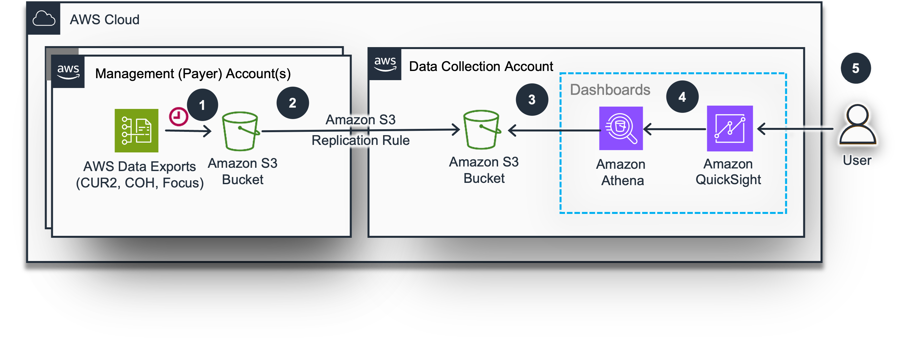
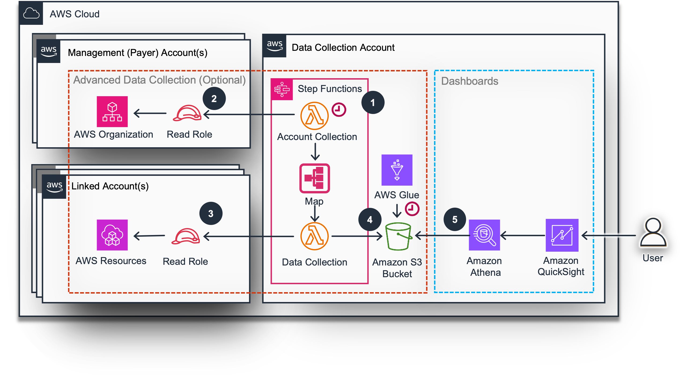

## CID Data Collection Framework

## Table of Contents
1. [Overview](#Overview)
1. [Architecture of Foundational Dashboards](#Architecture-of-Foundational-Dashboards)
1. [Cost](#Cost)
1. [Prerequisites](#Prerequisites)
1. [Deployment Steps](#Deployment-Steps)
1. [Cleanup](#Cleanup)
1. [FAQ](#FAQ)
1. [Changelogs](#Changelogs)
1. [Feedback](#Feedback)
1. [Security](#Security)
1. [License](#License)
1. [Notices](#Notices)

## Overview
This repository is a part of [Cloud Intelligence Dashboards](https://catalog.workshops.aws/awscid), a project that provides AWS customers with a series of in-depth and customizable dashboards for the most comprehensive cost and usage details to help optimize cost, track usage goals, and achieve operational excellence.

All Data Collections can be used independently from Dashboards. Typically data collections store data on Amazon S3 and provide AWS Glue tables and Athena Views to explore and use these data.

This repository contains following elements:
* [data-exports](/data-exports) - a Cloud Formation Templates for AWS Data Exports, such as Cost and Usage Report 2.0 and others. This allows a replication of Exports from your Management Account(s) to a Dedicated Data Collection Accounts as well as aggregation of multiple Exports from a set of Linked Accounts.
* [data-collection](/data-collection) - a set of Cloud Formation Templates for collecting infrastructure operational data from Management and Linked Accounts. Such as data from AWS Trusted Advisor, AWS Compute Optimizer, Inventories, Pricing, AWS Health, AWS Support Cases etc. See more about types of data collected [here](/data-collection).
* [case-summarization](/case-summarization) - an additional Cloud Formation Template for deploying the AWS Support Case Summarization plugin that offers the capability to summarize cases through Generative AI powered by Amazon Bedrock.

### Other AWS Services
* [Collection of AWS Config data](https://github.com/aws-samples/config-resource-compliance-dashboard)

### Multi-cloud data
* [Collection of Azure Cost Data](https://github.com/aws-samples/aws-data-pipelines-for-azure-storage/)
* [Collection of GCP Cost Data](https://github.com/awslabs/cid-gcp-cost-dashboard/)
* [Collection of OCI Cost Data](https://github.com/awslabs/cid-oci-cost-dashboard/)

## Architecture Data Exports

1. [AWS Data Exports](https://aws.amazon.com/aws-cost-management/aws-data-exports/) delivers daily the Cost & Usage Report (CUR2) to an [Amazon S3 Bucket](https://aws.amazon.com/s3/) in the Management Account.
2. [Amazon S3](https://aws.amazon.com/s3/) replication rule copies Export data to a dedicated Data Collection Account S3 bucket automatically.
3. [Amazon Athena](https://aws.amazon.com/athena/) allows querying data directly from the S3 bucket using an [AWS Glue](https://aws.amazon.com/glue/) table schema definition.
4. [Amazon QuickSight](https://aws.amazon.com/quicksight/) datasets can read from [Amazon Athena](https://aws.amazon.com/athena/). Check Cloud Intelligence Dashboards.

See more in [data-exports](/data-exports).

## Architecture Data Collection

1. The Advanced Data Collection can be deployed to enable advanced dashboards based on [AWS Trusted Advisor](https://aws.amazon.com/trustedadvisor/), [AWS Health Events](https://docs.aws.amazon.com/health/latest/ug/getting-started-phd.html) and other sources. Additional data is retrieved from [AWS Organization](https://aws.amazon.com/organizations/) or Linked Accounts. In this case [Amazon EventBridge](https://aws.amazon.com/eventbridge/) rule triggers an [AWS Step Functions](https://aws.amazon.com/step-functions/) for data collection modules on a configurable schedule.

2. The "Account Collector" [AWS Lambda](https://aws.amazon.com/lambda/) in AWS Step Functions retrieves linked account details using [AWS Organizations API](https://docs.aws.amazon.com/organizations/latest/APIReference/Welcome.html).

3. The "Data Collection" Lambda function in AWS Step Functions assumes role in each linked account to retrieve account-specific data via [AWS SDK](https://aws.amazon.com/sdk-for-python/).

4. Retrieved data is stored in a centralized [Amazon S3 Bucket](https://aws.amazon.com/s3/).

5. Advanced Cloud Intelligence Dashboards leverage [Amazon Athena](https://aws.amazon.com/athena/) and [Amazon QuickSight](https://aws.amazon.com/quicksight/) for comprehensive data analysis.

See more in [data-collection](/data-collection).

## Cost
The following table provides a sample cost breakdown for deploying of Foundational Dashboards with the default parameters in the US East (N. Virginia) Region for one month. 

| AWS Service                     | Dimensions                    |  Cost [USD]      |
|---------------------------------|-------------------------------|------------------|
| S3                              | Monthly storage               | $5-10/month*     |
| AWS Glue Crawler                | Monthly operation.            | $3/month*        |
| AWS Athena                      | Data scanned monthly          | $15/month*       |
| **Total Estimated Monthly Cost** |                              | **<$50**          |

\* Costs are relative to the size of collected data (number of workloads, AWS Accounts, Regions etc).

Pleas use AWS Pricing Calculator for precise estimation.

## Prerequisites
You need access to AWS Accounts. We recommend deployment of the Data Collection in a dedicated Data Collection Account, other than your Management (Payer) Account. You can use it to aggregate data from multiple Management (Payer) Accounts or multiple Linked Accounts.

If you do not have access to the Management/Payer Account, you can still collect some types fo data across multiple Linked accounts.

## Deployment and Cleanup Steps
Reference to folders.
* [data-exports](/data-exports)
* [data-collection](/data-collection)
* [case-summarization](/case-summarization)

## Changelogs
Check [Releases](/releases)

## Feedback
Please reference to [this page](https://catalog.workshops.aws/awscid/en-US/feedback-support)

## Contribution
See [CONTRIBUTING](CONTRIBUTING.md) for more information.

## Security
When you build systems on AWS infrastructure, security responsibilities are shared between you and AWS. This [shared responsibility
model](https://aws.amazon.com/compliance/shared-responsibility-model/) reduces your operational burden because AWS operates, manages, and
controls the components including the host operating system, the virtualization layer, and the physical security of the facilities in
which the services operate. For more information about AWS security, visit [AWS Cloud Security](http://aws.amazon.com/security/).

See [SECURITY](SECURITY.md) for more information.

## License
This project is licensed under the Apache-2.0 License. See the [LICENSE](LICENSE) file.

## Notices
Dashboards and their content: (a) are for informational purposes only, (b) represents current AWS product offerings and practices, which are subject to change without notice, and (c) does not create any commitments or assurances from AWS and its affiliates, suppliers or licensors. AWS content, products or services are provided “as is” without warranties, representations, or conditions of any kind, whether express or implied. The responsibilities and liabilities of AWS to its customers are controlled by AWS agreements, and this document is not part of, nor does it modify, any agreement between AWS and its customers.

